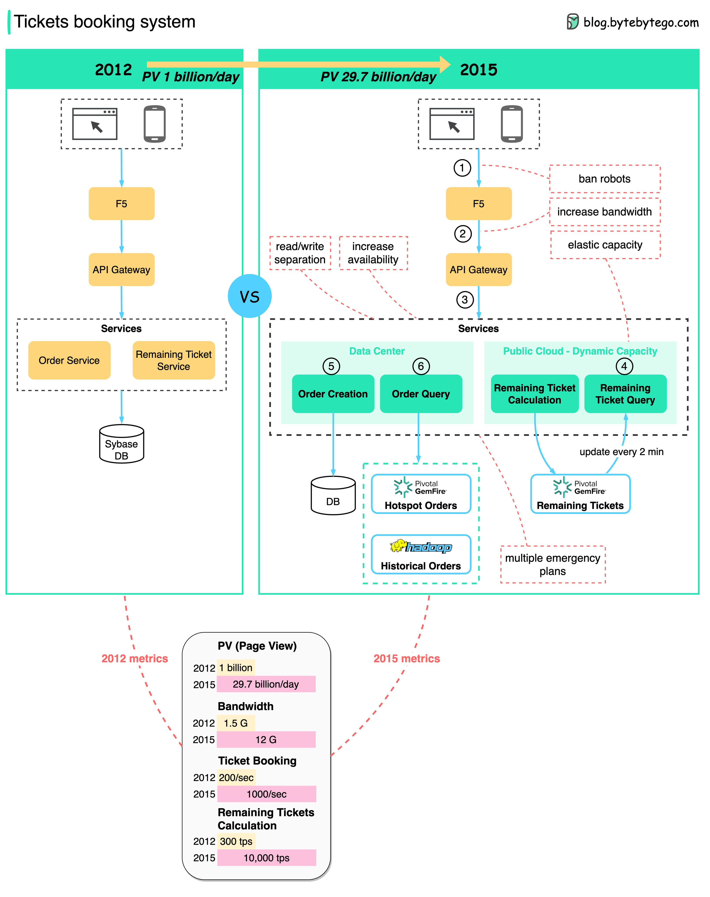

# China Train ticket booking system

**Source (Alex Xu, @alexxubyte). [Tweet](https://twitter.com/alexxubyte/status/1595098396221530118)**

## Problem
The China Train tickets booking system has the following challanges:
- Very high concurrent visits during peak hours.
- The QPS for checking remaining tickets and orders is very high
- A lot of bots

> **QPS/TPS** (Number of request/query/transactions per second): The number of requests/transactions per second.

## Solution
- **Separate read and write requests**: Because anxious users kept refreshing the web page to check if there were tickets available, the system could under huge pressure. To handle the calculation and query in memory, the remaining ticket components were moved entirely to GemFire. It is possible to fit the entire country's train tickets into several Gigabytes of memory. In addition, the order query component was moved to GemFire to reduce the load on the order database. Hadoop was used to store historical orders.

> [GemFire](https://tanzu.vmware.com/gemfire): VMware GemFire is a distributed, in-memory, key-value store that performs read and write operations at blazingly fast speeds. It offers highly available parallel message queues, continuous availability, and an event-driven architecture you can scale dynamically, with no downtime. As your data size requirements increase to support high-performance, real-time apps, VMware GemFire can scale linearly with ease.

- **Laverage public cloud for elastic capacity**
- **Ban bots. It reduced the traffic by 95%.**
- **Increase the bandwidth of the system.**
- **Increase system availability**

